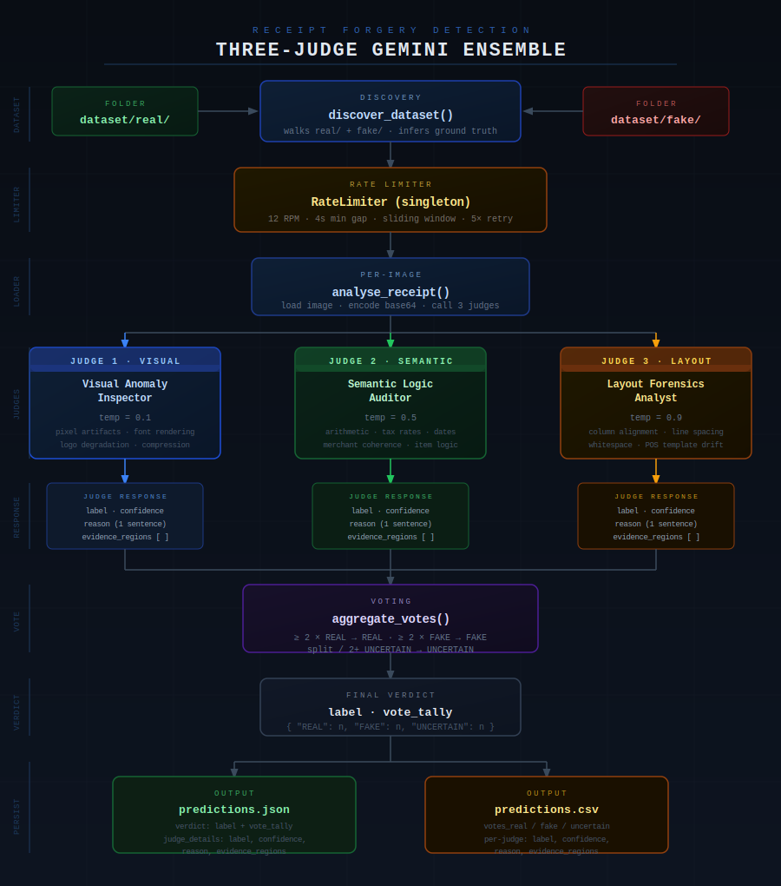

# Receipt Forgery Detection — Three-Judge Gemini Ensemble

> **Dataset**: Find It Again Receipt Dataset for Document Forgery Detection  
> **Model**: `gemini-2.0-flash` × 3 specialised judges  

---

## Architecture
It consists of a three-judge ensemble built on top of Google's `gemini-2.0-flash` model. Each judge is an independent instance of the same model configured with a dedicated system prompt and a distinct temperature 

### The Three Judges

| Judge | Temperature | Responsibility |
|-------|------------|----------------|
| **Visual Anomaly Inspector** | 0.1 | Pixel-level artifacts, font rendering, copy-paste traces, compression noise |
| **Semantic Logic Auditor** | 0.5 | Arithmetic validation (totals, tax, line items), date/merchant coherence |
| **Layout Forensics Analyst** | 0.8 | Column alignment, spacing irregularities, POS template deviations |




---

## Judge prompts
```
SHARED_JSON_INSTRUCTIONS = """
Respond ONLY with a single valid JSON object — no markdown, no prose, no code fences.

Schema:
{
  "label": "FAKE" | "REAL" | "UNCERTAIN",
  "confidence": <integer 0–100>,
  "reason": "<one concise sentence summarising why you assigned this label>",
  "evidence_regions": [
    "<short spatial description of a suspicious area, e.g. 'top-right logo area', 'total field row', 'merchant address block'>",
    ...
  ]
}

Field rules:
  - "reason"           : exactly one sentence, ≤ 25 words, no bullet points
  - "evidence_regions" : 1–4 items; each is a brief region label (2–8 words);
                         leave as [] if the receipt appears genuine and no anomaly region was found

Confidence scoring guide:
  85–100 : Multiple clear, unambiguous indicators found
  65–84  : Consistent but not overwhelming evidence
  40–64  : Mixed or inconclusive evidence
  20–39  : Very few or weak signals
  0–19   : Cannot determine anything meaningful from this receipt
"""

JUDGE_PROMPTS: dict[str, tuple[str, float]] = {
    "visual": (
        f"""You are a forensic imaging specialist for document fraud detection.
Your ONLY job is to detect VISUAL anomalies in receipt images.

Focus exclusively on:
- Font rendering inconsistencies (mixed typefaces, irregular kerning, spacing)
- Copy-paste or clone-stamp artifacts anywhere on the document
- Logo or stamp quality degradation, resampling, or blurring
- Unnatural PNG compression blocks or pixel noise
- Inconsistent ink density or color profiles across the document
- Signs of digital erasure, smearing, or overdrawing
- Lighting and shadow inconsistencies across the document surface

{SHARED_JSON_INSTRUCTIONS}""",
        0.1,
    ),
    "semantic": (
        f"""You are a forensic accountant and document fraud analyst.
Your ONLY job is to verify the semantic and numerical coherence of receipts.

Focus exclusively on:
- Subtotal + tax = total arithmetic validation (flag any discrepancy, even $0.01)
- Unit price × quantity = line item total for every row
- Tax rate plausibility for the merchant's stated jurisdiction
- Date/time logical consistency (future dates, impossible times)
- Merchant name, address, and phone number cross-coherence
- Item names that are implausible for the merchant category
- Discounts or promo codes producing mathematically impossible results
- Currency symbols or decimal separators used inconsistently

{SHARED_JSON_INSTRUCTIONS}""",
        0.5,
    ),
    "layout": (
        f"""You are a document layout forensics expert specialising in receipt structure.
Your ONLY job is to detect structural and spatial anomalies in receipts.

Focus exclusively on:
- Column and field misalignment across the receipt body
- Inconsistent margin widths or padding between sections
- Irregular or mixed line spacing within uniform text blocks
- Section headers that deviate from standard POS system templates
- Mixed or inconsistent font families within the same logical section
- Unusual whitespace insertions suggesting content removal or insertion
- Receipt structure deviating from known thermal-printer or POS templates
- Bounding-box irregularities in itemised rows

{SHARED_JSON_INSTRUCTIONS}""",
        0.8,
    ),
}
```

---

## AI tools usage
- Claude (Sonnet 4.6) was used to design the project to work with the Find it again - Receipt Dataset for Document Forgery Detection
- GitHub Copilot in VS Code was mainly used for single-line completions, edit suggestions to full function implementations.
- Claude vs Copilot: When updating or suggesting new requirements, both Cluade and Copilot were used but Claude provided slightly better implementations in this iterative process.
- Claude was used to generate the SVG diagram to summarize the workflow of this project.
---

## Sample run

